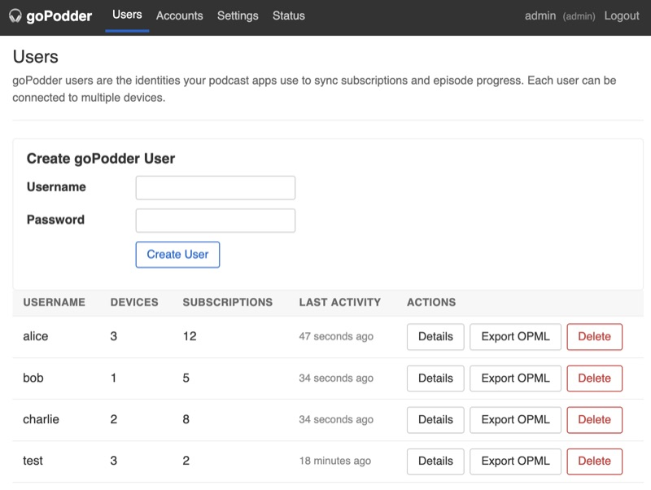
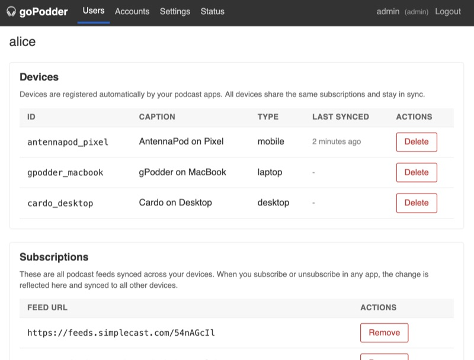
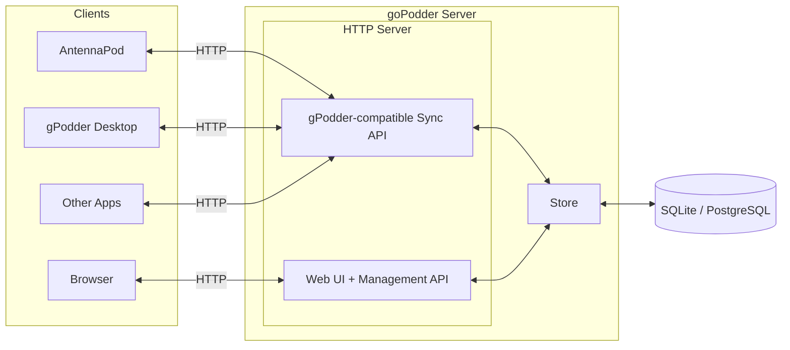

# 🎧 goPodder

[](https://github.com/cbrgm/gopodder/releases/latest)
[](https://goreportcard.com/report/github.com/cbrgm/gopodder)
[](https://github.com/cbrgm/gopodder/blob/main/go.mod)
[](https://github.com/cbrgm/gopodder/blob/main/LICENSE)
[](https://github.com/cbrgm/gopodder/actions/workflows/go-lint-test.yml)
[](https://github.com/cbrgm/gopodder/actions/workflows/container.yml)

**A self-hostable podcast synchronization server compatible with the [gPodder API](https://gpoddernet.readthedocs.io/en/latest/api/)**

goPodder does one thing: it keeps your podcast subscriptions and episode progress in sync across devices and apps. **Just synchronization, done well.** In production since mid-2025, syncing podcasts for friends and family

## Features

- Works with [AntennaPod](https://antennapod.org/), [gPodder](https://gpodder.github.io/), [Cardo](https://github.com/cardo-podcast/cardo), and anything else that speaks the [gPodder sync protocol](https://gpoddernet.readthedocs.io/en/latest/api/)
- Built-in web UI for managing accounts, users, devices, and subscriptions
- [REST API](APIDOCS.md) with API key auth for scripts, provisioning, and custom integrations
- Multi-user support with admin/standard roles, per-account user limits, optional self-registration
- SQLite by default (zero config), PostgreSQL if you need it
- Share your subscriptions publicly via OPML and RSS links
- No outbound connections. The server never phones home, never fetches feed URLs, never resolves external DNS. Your subscription data stays on your box
- Single binary, no dependencies, ~13 MB RAM at idle. Runs fine on a Raspberry Pi

<p>
  
  
</p>

## Why this exists

Other self-hostable options like [opodsync](https://github.com/kd2org/opodsync) require PHP and a web server, while [podsync](https://github.com/bobrippling/podsync) is minimal and lacks a web UI or multi-user support. Full podcast platforms like [Pinepods](https://github.com/madeofpendletonwool/PinePods) or [Audiobookshelf](https://github.com/advplyr/audiobookshelf) are media servers, not sync tools.

goPodder is a single binary with a built-in web UI, multi-user support, and SQLite or PostgreSQL. You bring your own podcast client (AntennaPod, gPodder, Cardo, etc.) and manage your podcasts there. goPodder only handles the synchronization between them. No runtime dependencies, no over-engineering. It deploys in seconds and just gets the job done. You won't even notice it's running

## Quick start

```bash
docker run --rm -p 8080:8080 ghcr.io/cbrgm/gopodder:latest
```

Open `http://localhost:8080` in your browser. On first launch you'll be asked to create an admin account. After that, create a goPodder user from the web UI and point your podcast app at the server.

## Setup

### Configuration flags

All flags can also be set via environment variables. The env var takes precedence over the default but the flag takes precedence over the env var

| Flag | Env var | Default | Description |
|------|---------|---------|-------------|
| `--listen-address` | `GOPODDER_LISTEN_ADDRESS` | `0.0.0.0:8080` | HTTP listen address (host:port) |
| `--debug-address` | `GOPODDER_DEBUG_ADDRESS` | | Debug/metrics listen address (disabled if empty) |
| `--db-backend` | `GOPODDER_DB_BACKEND` | `sqlite` | Database backend (`sqlite` or `postgres`) |
| `--db-path` | `GOPODDER_DB_PATH` | `gopodder.db` | Path to SQLite database file |
| `--db-postgres` | `GOPODDER_DB_POSTGRES` | | PostgreSQL connection string |
| `--db-postgres-password` | `GOPODDER_DB_POSTGRES_PASSWORD` | | PostgreSQL password (injected into connection string) |
| `--log-level` | `GOPODDER_LOG_LEVEL` | `info` | Log level (`debug`, `info`, `warn`, `error`) |

### Database backends

goPodder supports two database backends. Pick whichever fits your setup

**SQLite** (default) is the simplest option. No external database needed. Data is stored in a single file. Good for personal use and small deployments

**PostgreSQL** is available if you already run Postgres or need to scale beyond a single instance

### Docker Compose with SQLite

The easiest way to run goPodder. Data is persisted in a Docker volume

```yaml
services:
  gopodder:
    image: ghcr.io/cbrgm/gopodder:latest
    command: serve --db-path /data/gopodder.db
    ports:
      - "8080:8080"
    volumes:
      - gopodder-data:/data
    restart: unless-stopped

volumes:
  gopodder-data:
```

### Docker Compose with PostgreSQL

```yaml
services:
  gopodder:
    image: ghcr.io/cbrgm/gopodder:latest
    command: serve --db-backend postgres --db-postgres "postgres://gopodder:secret@db:5432/gopodder?sslmode=disable"
    ports:
      - "8080:8080"
    depends_on:
      - db
    restart: unless-stopped

  db:
    image: postgres:17-alpine
    environment:
      POSTGRES_USER: gopodder
      POSTGRES_PASSWORD: secret
      POSTGRES_DB: gopodder
    volumes:
      - pg-data:/var/lib/postgresql/data
    restart: unless-stopped

volumes:
  pg-data:
```

### Podman Quadlet with secrets

If you run Podman and want to avoid putting the database password in plain text, use `GOPODDER_DB_POSTGRES_PASSWORD` with a [Podman secret](https://docs.podman.io/en/latest/markdown/podman-secret-create.1.html):

```ini
[Container]
Image=ghcr.io/cbrgm/gopodder:latest
ContainerName=gopodder
Environment=GOPODDER_DB_BACKEND=postgres
Environment=GOPODDER_DB_POSTGRES=postgres://gopodder@pg_server:5432/gopodder
Secret=gopodder_db_pass,type=env,target=GOPODDER_DB_POSTGRES_PASSWORD
```

The password is injected into the connection string at startup. Special characters in the password are URL-encoded automatically

## Connecting your podcast app

1. Create a goPodder user in the web UI (under the "Users" tab)
2. In your podcast app, look for "gPodder.net sync" or "Synchronize subscriptions"
3. Set the server URL to `https://your-server`
4. Log in with the goPodder user credentials you created

**Note:** Some clients (like AntennaPod) require HTTPS. goPodder itself does not terminate TLS, so you'll need to run it behind a reverse proxy like [Caddy](https://caddyserver.com/) or [nginx](https://nginx.org/) that handles HTTPS. For quick testing, tunnels like [Cloudflare Tunnel](https://developers.cloudflare.com/cloudflare-one/connections/connect-networks/), [Tailscale Funnel](https://tailscale.com/kb/1223/funnel), or [ngrok](https://ngrok.com/) work but a reverse proxy is the proper solution for permanent setups

Tested with:

- [AntennaPod](https://antennapod.org/) (Android)
- [gPodder](https://gpodder.github.io/) (Desktop, Linux/macOS/Windows)
- [Cardo](https://github.com/cardo-podcast/cardo) (Windows/macOS/Linux)

Should also work (not yet tested):

- [KDE Kasts](https://apps.kde.org/kasts/) (Linux/Android/Windows)

Any client that supports the gPodder.net sync protocol should work. If you've tested goPodder with a client not listed here, please [open an issue](https://github.com/cbrgm/gopodder/issues) and let us know

## Backups

goPodder doesn't need its own backup tooling. Use the standard tools for your database backend

### SQLite

The database is a single file. goPodder runs in WAL mode, so you can safely copy it while the server is running

```bash
cp /path/to/gopodder.db /backups/gopodder-$(date +%F).db
```

With Docker Compose (assuming you use a bind mount or named volume):

```bash
docker cp gopodder:/data/gopodder.db /backups/gopodder-$(date +%F).db
```

### PostgreSQL

Use `pg_dump` as you would for any Postgres database:

```bash
docker exec gopodder-db pg_dump -U gopodder gopodder > /backups/gopodder-$(date +%F).sql
```

Both approaches work with any existing backup infrastructure (Proxmox Backup Server, restic, borgmatic, rsync to NAS, etc.). Schedule them via cron or systemd timers

## Monitoring

goPodder exposes Prometheus metrics and Go pprof profiling on a separate debug server. This is disabled by default and must be explicitly enabled via `--debug-address`

```bash
gopodder serve --debug-address 127.0.0.1:6060
```

Once enabled, the following endpoints are available on the debug address:

| Endpoint | Description |
|----------|-------------|
| `/metrics` | Prometheus metrics (HTTP request counts, durations, sync operations) |
| `/debug/pprof/` | Go pprof profiling (heap, goroutines, CPU) |

The debug server runs on a separate port from the main application. Keep it on `127.0.0.1` (localhost) for local access only, or bind to `0.0.0.0` if your monitoring stack runs on a different host. In that case, restrict access at the network/firewall level

Prometheus scrape config example:

```yaml
scrape_configs:
  - job_name: gopodder
    static_configs:
      - targets: ['your-server:6060']
```

## gPodder API compatibility

goPodder implements the synchronization parts of the [gPodder API](https://gpoddernet.readthedocs.io/en/latest/api/): authentication, devices, subscriptions, and episode actions. This covers everything podcast clients use to sync data between devices

The gpodder.net API also includes directory, search, suggestions, and social features. goPodder does not implement these because they are specific to gpodder.net as a platform and no podcast client requires them for synchronization

## How sync works

goPodder syncs three things: subscriptions (which podcasts you follow), episode actions (played, downloaded, position), and device registrations. All of this is stored per user, not per device. All your devices share the same data.

**Will I lose my podcasts when I add a new device?**

No. Most apps (AntennaPod, gPodder desktop) pull the server's data first, merge it with whatever you have locally, then push back anything new. You end up with everything from both sides.

**What if I want my phone to overwrite everything?**

Some apps have a "force upload" option that replaces the server's subscription list entirely. That will wipe any subscriptions that only existed on your other devices. It's there if you need it, but check your app's sync settings before you hit it. Episode actions are append-only, so those always merge.

**What decides what happens during sync, the server or the app?**

The app. goPodder just stores what gets sent and serves it back. It doesn't pick a merge strategy, doesn't resolve conflicts, doesn't reorder anything. Subscription adds are added, removes are removed. Episode actions are recorded as-is.

**Does goPodder fetch my feeds or phone home?**

No. The server never makes outbound network connections. It stores your feed URLs and episode progress as data and hands them back to your devices when they ask. Your podcast app does the actual fetching. goPodder is a sync service, not a feed reader or aggregator.

## REST API

goPodder provides a REST API for programmatic access to manage users, subscriptions, and accounts. Create API keys in the web UI under **Account > API Keys** and authenticate with a Bearer token:

```bash
curl -H "Authorization: Bearer gp_your_key_here" https://your-server/api/v1/users
```

Use it to build backup scripts, provisioning automation, or custom integrations. See the full **[API Documentation](APIDOCS.md)** for all endpoints, examples, and usage guides.

## Architecture



Podcast apps sync subscriptions and episode progress over HTTP using the gPodder-compatible sync API. The web UI and its management API handle account, user, and subscription administration. Both talk to the same store layer, which supports SQLite or PostgreSQL

## Building from source

Requirements: Go 1.26+ (all other tools are managed as Go tool dependencies)

```bash
go build -o gopodder ./cmd/gopodder
./gopodder serve
```

### Code generation

The project uses [sqlc](https://sqlc.dev/) for type-safe SQL queries and [templ](https://templ.guide/) for HTML templates. Both are declared in `go.mod` as tool dependencies, so no separate installation is needed

After modifying SQL queries or `.templ` files, regenerate with:

```bash
go generate ./...
```

### Running tests

```bash
go test ./...
```

### Linting

```bash
golangci-lint run ./...
```

## Contributing

Please open an issue before submitting large changes

## License

Apache 2.0
